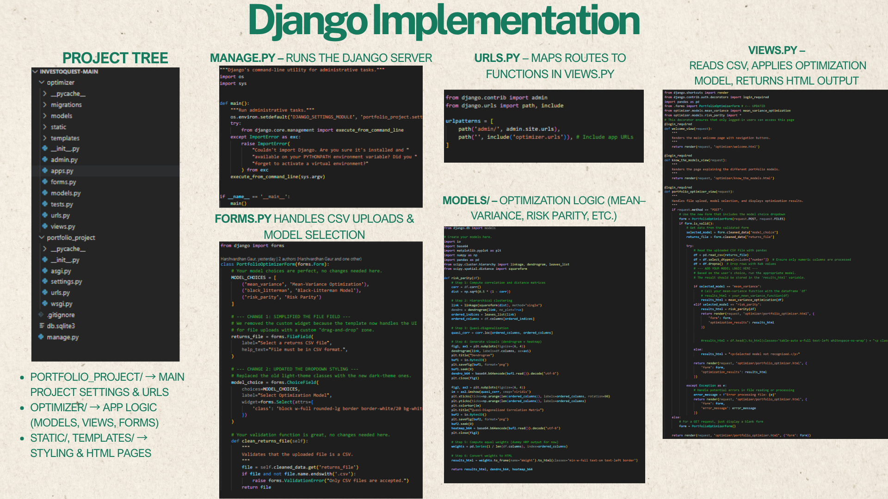
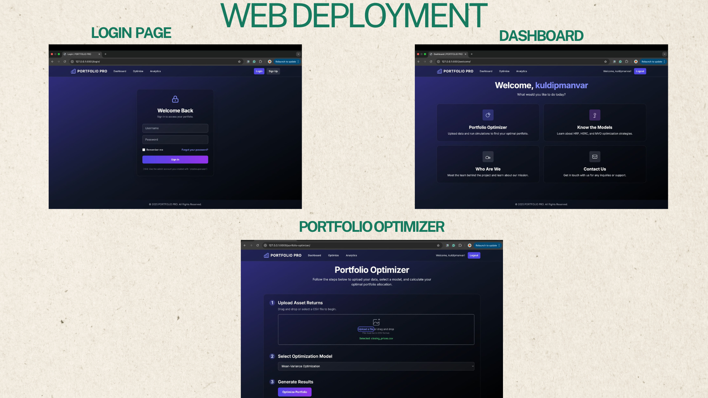

# InvestoQuest

InvestoQuest is a quantitative portfolio analytics project focused on portfolio construction, optimization and historical backtesting using Modern Portfolio Theory and Hierarchical Equal Risk Contribution (HERC). The project explores multiple portfolio allocation techniques, evaluates their historical performance and demonstrates how optimization-based strategies can improve portfolio risk-return characteristics. The developed analytics pipeline was integrated into a Django-based web application for interactive portfolio analysis and visualization.

## Project Overview

This repository presents a complete portfolio analysis workflow:

```text
Financial Data
-> Data Preprocessing
-> Portfolio Weighting
-> Portfolio Backtesting
-> Efficient Frontier Optimization
-> Dynamic Rebalancing
-> Performance Evaluation
```
## Key Features

- Portfolio construction using multiple allocation strategies
- Historical portfolio backtesting
- Efficient Frontier and Maximum Sharpe portfolio optimization
- Mean-Variance portfolio construction
- Hierarchical Risk Parity (HRP) and HERC portfolio optimization
- Transaction cost-aware dynamic rebalancing
- Portfolio performance evaluation using risk-adjusted metrics
- Integration of the analytics pipeline into a Django-based web application

## Project Presentation

A comprehensive presentation summarizing the project motivation, quantitative portfolio optimization techniques, implementation methodology and application workflow.
**Presentation**

- [`presentation/investoquest-project-presentation.pdf`](presentation/investoquest-project-presentation.pdf)

## Analysis Workflow

## 1. Data Preprocessing

The first stage focuses on preparing financial data for portfolio analysis. This includes cleaning the dataset, formatting price data, handling missing values, calculating returns and preparing the final dataset for modeling.

Notebook:

- [`notebooks/data-preprocessing.ipynb`](notebooks/data-preprocessing.ipynb)

This step creates the foundation for all later portfolio analysis.

## 2. Portfolio Weighting

This section explores portfolio construction through different asset weighting methods. The goal is to understand how capital allocation across assets affects total portfolio performance, risk and diversification.

Notebook:

- [`notebooks/portfolio-weighting.ipynb`](notebooks/portfolio-weighting.ipynb)


## 3. Portfolio Backtesting

Backtesting is used to evaluate how portfolio strategies would have performed using historical market data. This helps test whether a strategy is meaningful beyond theoretical calculations.

Notebook:

- [`notebooks/portfolio-backtesting.ipynb`](notebooks/portfolio-backtesting.ipynb)


## 4. Efficient Frontier Optimization

This section focuses on portfolio optimization using the efficient frontier. The objective is to identify portfolios that offer better expected returns for a given level of risk.

Notebook:

- [`notebooks/efficient-frontier-optimization.ipynb`](notebooks/efficient-frontier-optimization.ipynb)

Detailed report:

- [`analysis/portfolio-optimization-analysis.pdf`](analysis/portfolio-optimization-analysis.pdf)

Key visuals:


## 5. Dynamic Rebalancing With HERC

The final stage applies dynamic portfolio rebalancing using HERC, or Hierarchical Equal Risk Contribution. This approach uses hierarchical clustering to group related assets and allocate risk more effectively.

Notebook:

- [`notebooks/dynamic-rebalancing-herc.ipynb`](notebooks/dynamic-rebalancing-herc.ipynb)

Detailed report:

- [`analysis/dynamic-portfolio-rebalancing-analysis.pdf`](analysis/dynamic-portfolio-rebalancing-analysis.pdf)

Key visuals:


## Results and Insights

The project compares multiple portfolio construction techniques ranging from traditional mean-variance optimization to hierarchical risk based allocation.

Efficient Frontier optimization demonstrates how optimized portfolios can achieve improved risk return tradeoffs compared to naïve allocations, while historical backtesting highlights the practical performance of these strategies under real market conditions.

The implementation of HERC with transaction cost aware dynamic rebalancing further illustrates how adaptive portfolio allocation can respond to changing market structures while accounting for realistic trading constraints.

## Application Interface

The portfolio analytics engine developed in this project was integrated into a Django-based web application to provide an interface for portfolio construction, optimization and historical performance analysis. The screenshots below illustrate the application interface used to interact with the underlying analytics modules.

### Architecture



### Application Interface



## Documentation

### Presentation

- [`investoquest-project-presentation.pdf`](presentation/investoquest-project-presentation.pdf)

### Technical Reports

- [`portfolio-optimization-analysis.pdf`](analysis/portfolio-optimization-analysis.pdf)
- [`dynamic-portfolio-rebalancing-analysis.pdf`](analysis/dynamic-portfolio-rebalancing-analysis.pdf)

### Implementation Notebooks

- `data-preprocessing.ipynb`
- `portfolio-weighting.ipynb`
- `portfolio-backtesting.ipynb`
- `efficient-frontier-optimization.ipynb`
- `dynamic-rebalancing-herc.ipynb`


## How To Run

Install the required dependencies:

```bash
pip install -r requirements.txt
```

Then open the notebooks using Jupyter Notebook, JupyterLab, VS Code or Google Colab.

Recommended order:

1. `notebooks/data-preprocessing.ipynb`
2. `notebooks/portfolio-weighting.ipynb`
3. `notebooks/portfolio-backtesting.ipynb`
4. `notebooks/efficient-frontier-optimization.ipynb`
5. `notebooks/dynamic-rebalancing-herc.ipynb`

## Repository Structure

```text
InvestoQuest/
│
├── README.md
├── requirements.txt
│
├── notebooks/
│   ├── data-preprocessing.ipynb
│   ├── portfolio-weighting.ipynb
│   ├── portfolio-backtesting.ipynb
│   ├── efficient-frontier-optimization.ipynb
│   └── dynamic-rebalancing-herc.ipynb
│
├── presentation/
│   └── investoquest-project-presentation.pdf
│
├── analysis/
│   ├── portfolio-optimization-analysis.pdf
│   └── dynamic-portfolio-rebalancing-analysis.pdf
│
└── assets/
    └── images/
        ├── efficient-frontier.png
        ├── optimal-weights.png
        ├── backtesting.png
        ├── hierarchical-clustering.png
        ├── portfolio-allocation.png
        ├── dynamic-asset-allocation.png
        ├── django-architecture.png
        ├── dashboard.png
        └── benchmark-comparison.png
```

## Conclusion

InvestoQuest demonstrates an end-to-end quantitative portfolio management workflow—from financial data preprocessing and portfolio construction to optimization, historical backtesting, and dynamic rebalancing. The project combines portfolio optimization techniques with practical performance evaluation to study how different allocation strategies behave under changing market conditions.
