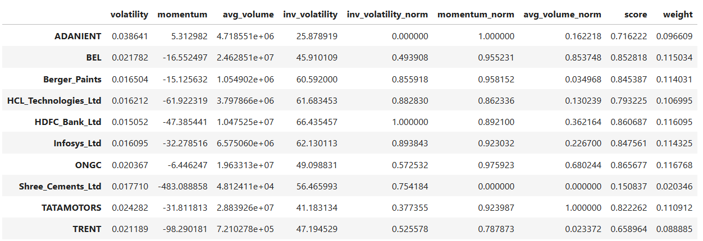
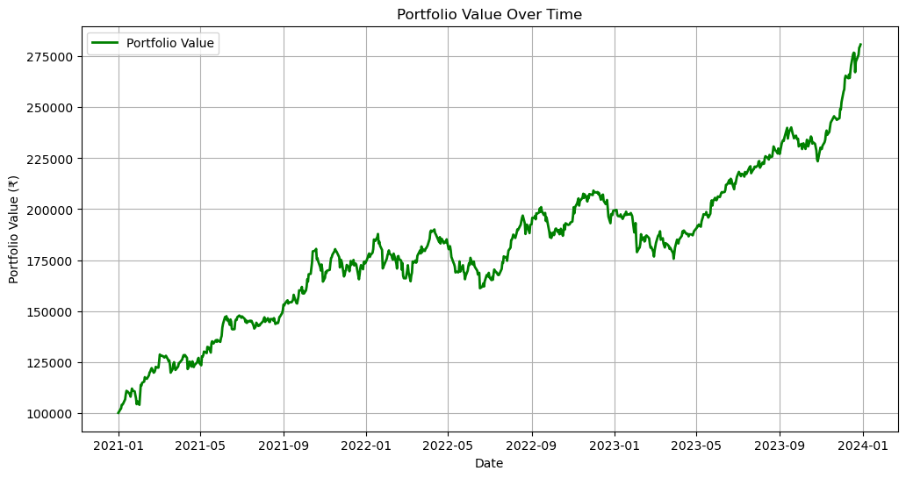
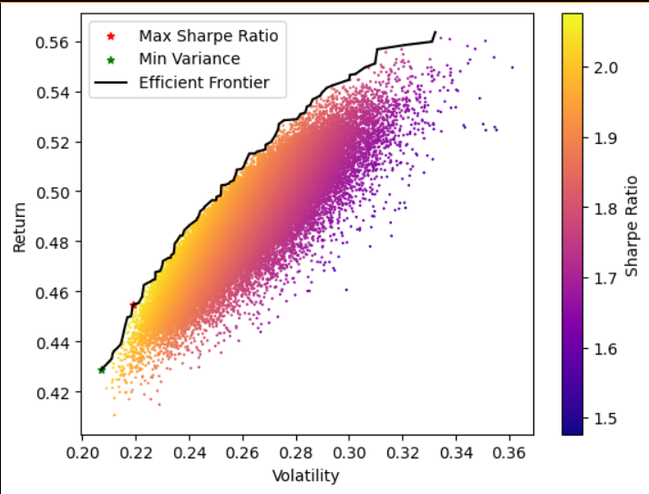
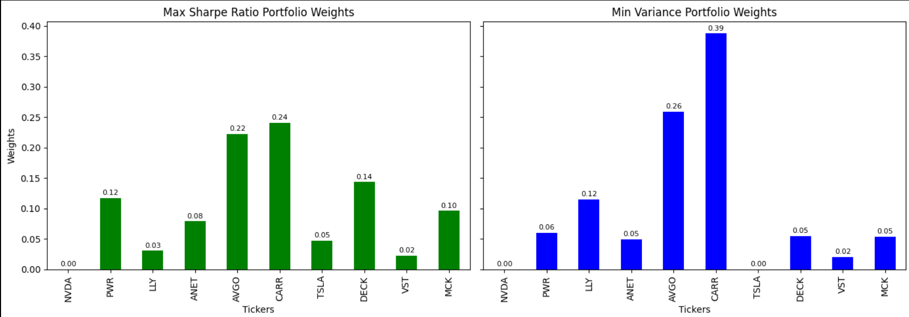
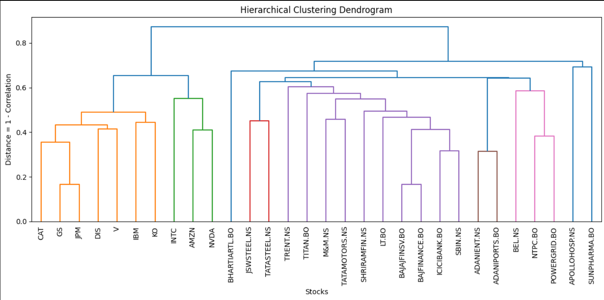
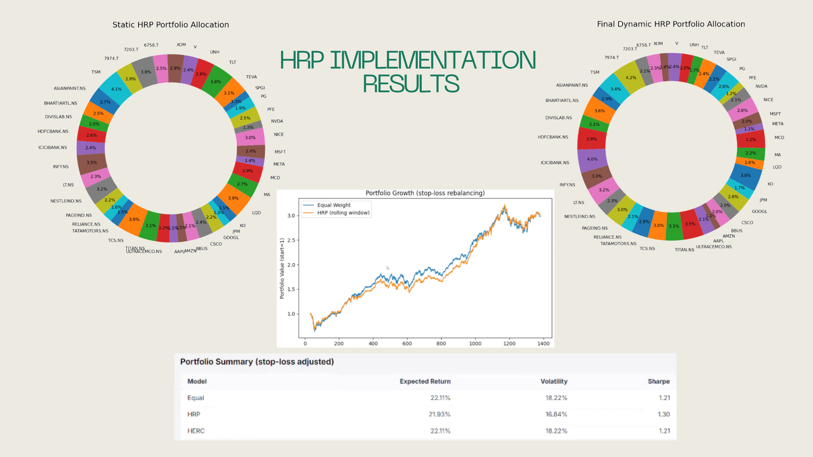
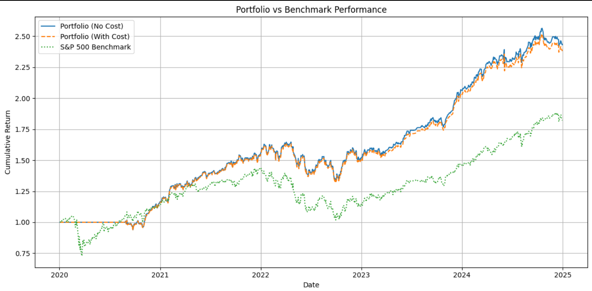

# InvestoQuest

InvestoQuest is a portfolio analytics and investment strategy project focused on building, testing and evaluating portfolio construction methods using financial data.

The project moves from data preprocessing and portfolio weighting to portfolio backtesting, efficient frontier optimization, hierarchical clustering and dynamic portfolio rebalancing using HERC.

## Project Overview

This repository presents a complete portfolio analysis workflow:

```text
Financial Data
-> Data Preprocessing
-> Portfolio Weighting
-> Portfolio Backtesting
-> Efficient Frontier Optimization
-> Dynamic Rebalancing
-> Performance Evaluation
```

## Analysis Workflow

## 1. Data Preprocessing

The first stage focuses on preparing financial data for portfolio analysis. This includes cleaning the dataset, formatting price data, handling missing values, calculating returns and preparing the final dataset for modeling.

Notebook:

- [`notebooks/data-preprocessing.ipynb`](notebooks/data-preprocessing.ipynb)

This step creates the foundation for all later portfolio analysis.

## 2. Portfolio Weighting

This section explores portfolio construction through different asset weighting methods. The goal is to understand how capital allocation across assets affects total portfolio performance, risk and diversification.

Notebook:

- [`notebooks/portfolio-weighting.ipynb`](notebooks/portfolio-weighting.ipynb)





## 3. Portfolio Backtesting

Backtesting is used to evaluate how portfolio strategies would have performed using historical market data. This helps test whether a strategy is meaningful beyond theoretical calculations.

Notebook:

- [`notebooks/portfolio-backtesting.ipynb`](notebooks/portfolio-backtesting.ipynb)





## 4. Efficient Frontier Optimization

This section focuses on portfolio optimization using the efficient frontier. The objective is to identify portfolios that offer better expected returns for a given level of risk.

Notebook:

- [`notebooks/efficient-frontier-optimization.ipynb`](notebooks/efficient-frontier-optimization.ipynb)

Detailed report:

- [`analysis/portfolio-optimization-analysis.pdf`](analysis/portfolio-optimization-analysis.pdf)

Key visuals:






## 5. Dynamic Rebalancing With HERC

The final stage applies dynamic portfolio rebalancing using HERC, or Hierarchical Equal Risk Contribution. This approach uses hierarchical clustering to group related assets and allocate risk more effectively.

Notebook:

- [`notebooks/dynamic-rebalancing-herc.ipynb`](notebooks/dynamic-rebalancing-herc.ipynb)

Detailed report:

- [`analysis/dynamic-portfolio-rebalancing-analysis.pdf`](analysis/dynamic-portfolio-rebalancing-analysis.pdf)

Key visuals:








## Results And Insights

The project shows how portfolio construction changes when different methods are applied. Simple weighting methods provide a useful baseline, while optimization-based approaches help identify better risk-return tradeoffs.

Efficient frontier optimization highlights the relationship between expected return and volatility. It helps locate portfolios that are more efficient than naive allocation methods.

Backtesting adds practical value by showing how strategies perform over historical periods. This is important because a mathematically optimal portfolio may not always remain stable under changing market conditions.

The dynamic rebalancing approach using HERC adds another layer of analysis. By using hierarchical clustering, the portfolio can account for relationships between assets and adjust allocation over time.

## Reports

The final written analysis reports are included in the `analysis/` folder:

- [`portfolio-optimization-analysis.pdf`](analysis/portfolio-optimization-analysis.pdf)
- [`dynamic-portfolio-rebalancing-analysis.pdf`](analysis/dynamic-portfolio-rebalancing-analysis.pdf)


## How To Run

Install the required dependencies:

```bash
pip install -r requirements.txt
```

Then open the notebooks using Jupyter Notebook, JupyterLab, VS Code or Google Colab.

Recommended order:

1. `notebooks/data-preprocessing.ipynb`
2. `notebooks/portfolio-weighting.ipynb`
3. `notebooks/portfolio-backtesting.ipynb`
4. `notebooks/efficient-frontier-optimization.ipynb`
5. `notebooks/dynamic-rebalancing-herc.ipynb`


## Project Files

| Type | File |
| --- | --- |
| Notebook | [`data-preprocessing.ipynb`](notebooks/data-preprocessing.ipynb) |
| Notebook | [`portfolio-weighting.ipynb`](notebooks/portfolio-weighting.ipynb) |
| Notebook | [`portfolio-backtesting.ipynb`](notebooks/portfolio-backtesting.ipynb) |
| Notebook | [`efficient-frontier-optimization.ipynb`](notebooks/efficient-frontier-optimization.ipynb) |
| Notebook | [`dynamic-rebalancing-herc.ipynb`](notebooks/dynamic-rebalancing-herc.ipynb) |
| Report | [`portfolio-optimization-analysis.pdf`](analysis/portfolio-optimization-analysis.pdf) |
| Report | [`dynamic-portfolio-rebalancing-analysis.pdf`](analysis/dynamic-portfolio-rebalancing-analysis.pdf) |

## Repository Structure

```text
InvestoQuest/
│
├── README.md
├── requirements.txt
│
├── notebooks/
│   ├── data-preprocessing.ipynb
│   ├── portfolio-weighting.ipynb
│   ├── portfolio-backtesting.ipynb
│   ├── efficient-frontier-optimization.ipynb
│   └── dynamic-rebalancing-herc.ipynb
│
├── analysis/
│   ├── portfolio-optimization-analysis.pdf
│   └── dynamic-portfolio-rebalancing-analysis.pdf
│
├── assets/
│   └── images/
│       ├── efficient-frontier.png
│       ├── optimal-weights.png
│       ├── backtesting.png
│       ├── hierarchical-clustering.png
│       ├── portfolio-allocation.png
│       ├── dynamic-asset-allocation.png
│       └── benchmark-comparison.png
│
└── data/
```

## Conclusion

InvestoQuest demonstrates a complete portfolio analysis workflow from raw financial data preparation to advanced portfolio optimization and dynamic rebalancing. The project combines quantitative methods, visual analysis and written interpretation to evaluate how different portfolio strategies perform under historical market conditions.
